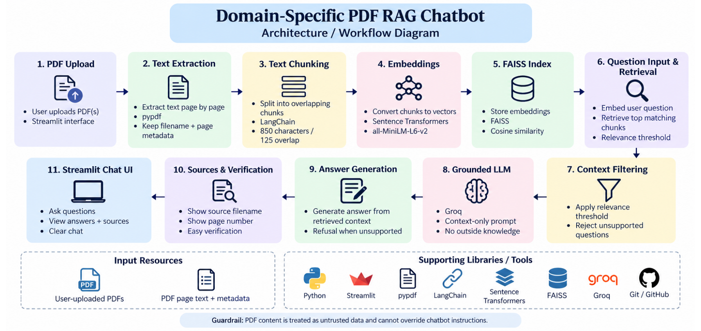

# Domain-Specific PDF RAG Chatbot

A Streamlit application that lets a user upload PDF documents and ask grounded questions about their contents. It retrieves relevant text chunks with FAISS and displays the source document and page number below each answer.

> **Academic note:** this project is a complete implementation for learning and demonstration. Understand the code, replace the supplied fictional documents with permitted material, run the tests, and describe your own results in your submission.

## Features matched to the project brief

- Multiple PDF upload, PDF-only validation, 10 MB per-file limit, selected file names, and clear/replace controls.
- Page-by-page extraction with `pypdf`; empty pages are skipped safely and metadata retains filename and page number.
- Overlapping chunks using LangChain's `RecursiveCharacterTextSplitter` (850 characters with 125-character overlap).
- `all-MiniLM-L6-v2` embeddings in a FAISS cosine-similarity index, with optional safe local persistence using FAISS plus JSON rather than pickle.
- Top 4 retrieval with a relevance threshold before an LLM request; sources display filename, page number, score, and a short excerpt.
- A strict context-only prompt, prompt-injection resistance, and the exact fallback: `I could not find this information in the uploaded documents.`
- Streamlit chat history, clear-chat button, setup documentation, two sample PDFs, workflow diagram, and a 17-row evaluation sheet.

## Architecture



The indexing path is **PDF upload -> pypdf page extraction -> LangChain chunking -> MiniLM embeddings -> FAISS**. The question path is **question -> FAISS top-k retrieval -> relevance gate -> strict Groq prompt -> answer plus page citations**.

## Setup

Requirements: Python 3.10 or later and a [Groq API key](https://console.groq.com/keys). The default model is configurable; confirm an available model in the [Groq model list](https://console.groq.com/docs/models) if you change it.

```bash
git clone <your-repository-url>
cd domain_rag_chatbot
python -m venv .venv
# Windows PowerShell
.\.venv\Scripts\Activate.ps1
pip install -r requirements.txt
Copy-Item .env.example .env
# Edit .env and add GROQ_API_KEY. Do not share or commit it.
streamlit run app.py
```

On macOS/Linux, activate with `source .venv/bin/activate` and copy the example file with `cp .env.example .env`.

## How to demonstrate it

1. Start the app and upload the two PDFs in `documents/`.
2. Click **Process documents**. On first use, `sentence-transformers` may download the MiniLM model.
3. Ask: `How many annual leave days does a full-time employee receive?`
4. Confirm that the response cites `BrightPath_Leave_Policy.pdf, page 1`.
5. Ask: `What is the company stock price?` and confirm the exact fallback message.
6. Click **Clear chat**, then **Clear docs** to demonstrate session control.

## Tests and evaluation

Run the fast unit tests:

```bash
pytest -q
```

Use `test_questions.csv` as the manual evaluation sheet. It has 17 questions, including two questions whose answer is deliberately unavailable. Record the actual source and a pass/fail result before you submit.

## Project structure

```text
domain_rag_chatbot/
├── app.py                    # Streamlit interface
├── document_loader.py        # PDF validation and page-level text extraction
├── rag_pipeline.py           # chunking, retrieval, grounded answer flow
├── vector_store.py           # MiniLM embeddings and FAISS persistence
├── prompt.py                 # strict prompt guardrail
├── documents/                # fictional demo PDFs
├── tests/                    # fast unit tests
├── test_questions.csv        # 17-question evaluation sheet
├── architecture.svg          # deliverable workflow diagram
├── create_sample_documents.py
├── requirements.txt
└── .env.example
```

## Responsible AI and security

- Do not upload confidential or copyrighted documents without permission.
- Do not commit `.env`, API keys, or a saved index containing sensitive text.
- Uploaded document content is treated as untrusted data. Instructions inside a PDF cannot override the system prompt.
- A retrieval threshold and strict prompt reduce hallucinations but do not guarantee correctness. Verify high-stakes answers in the source document.
- Scanned PDFs need OCR; this baseline intentionally skips pages with no extractable text.

## Deployment and GitHub checklist

1. Create a GitHub repository, add these files, and confirm `.env` remains ignored.
2. Add `GROQ_API_KEY` as a Streamlit Cloud secret rather than uploading `.env`.
3. Deploy from the repository root with `app.py` as the entry point.
4. Test a known-answer question and an unavailable-answer question after deployment.

## Suggested viva answers

- **What is RAG?** Retrieval-Augmented Generation retrieves relevant document text before asking an LLM to answer.
- **Why chunk documents?** Chunks make retrieval focused and keep the LLM context within a practical size.
- **What is an embedding?** It is a numerical representation of text meaning used to compare related passages.
- **What does FAISS store?** In this project, it indexes the chunk embeddings; separate JSON stores the text and source metadata.
- **Why cosine similarity?** With normalised vectors, inner product equals cosine similarity and ranks semantically similar chunks.
- **Can RAG be wrong?** Yes. Retrieval may miss evidence or an LLM may misread context, so sources and evaluation are essential.
